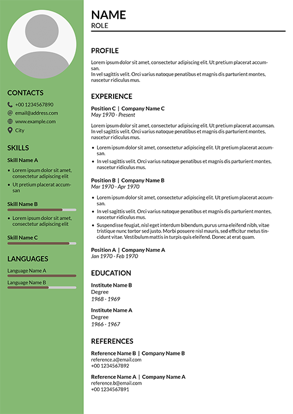

# Resume Creator Examples

## [Output](./output)
Here you'll find some samples of generated resumes.

<table>
  <tbody>
    <tr>
      <td align="center" valign="top">
        <a href="./output/placeholders.pdf">
          
        <br>
        </a>
        <a href="./output/placeholders.pdf">Placeholders</a>
      </td>
  </tbody>
</table>

## [Viewer](./viewer)
A simple react app that displays a PDF resume.

## [Server](./server)
A simple Fastify server with a couple of REST API that return a generated PDF resume.

## [CLI](./cli)
A simple cli that takes the resume data and saves the generated pdf resume to file.  
Run from its folder it with:
```sh
$ npm run create -- -d <path-to-data> [-o <output-dir>] [-n <filename>] [-l <language>]
```

